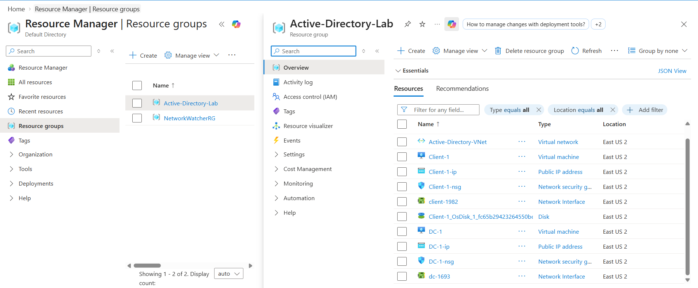
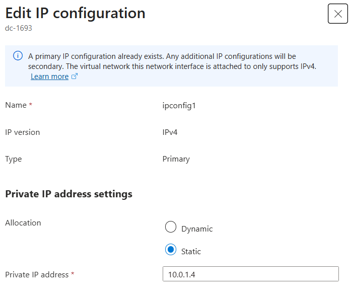
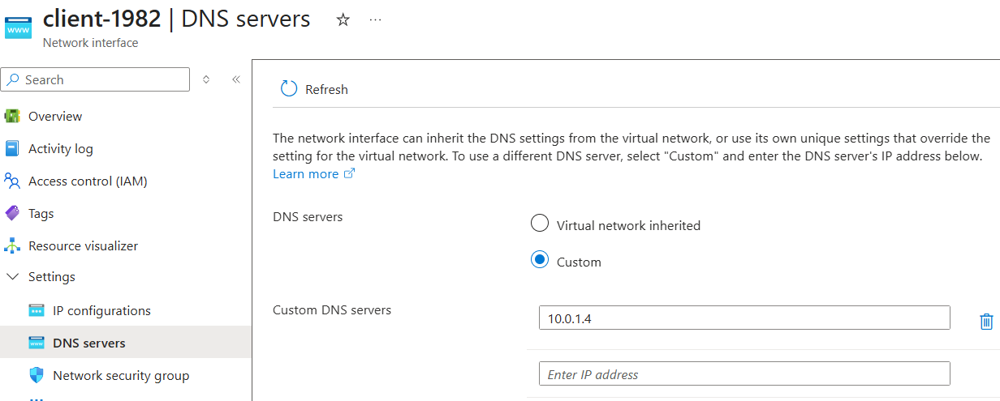
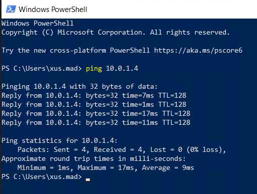
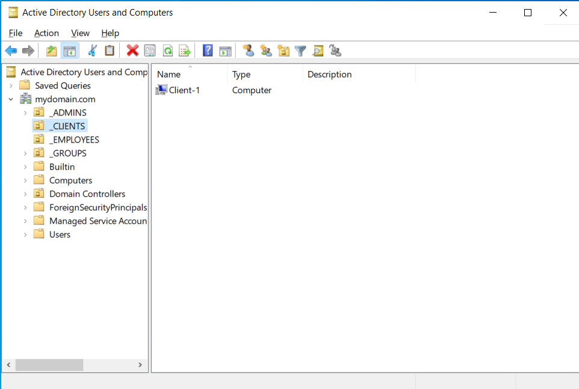
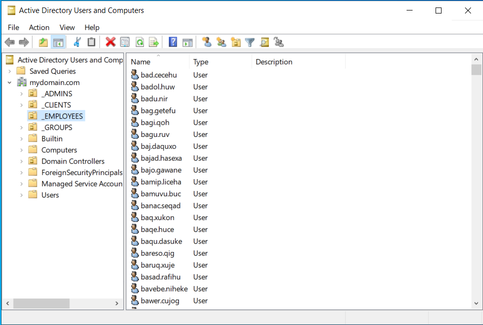

# Active Directory Azure Lab
Active Directory lab built in Microsoft Azure

## Project Overview

This project documents the Active Directory lab I completed using Microsoft Azure. The lab involved building a Windows Server domain environment and practicing common IT support and system administration tasks.

## Technologies Used

- Microsoft Azure
- Windows Server 2022
- Windows 10
- Active Directory Domain Services
- PowerShell
- DNS
- Group Policy

## Lab Architecture

The lab was built in Microsoft Azure using two virtual machines connected to the same virtual network.

- **DC-1** - Windows Server 2022 virtual machine used as the domain controller and DNS server.
- **Client-1** - Windows 10 virtual machine used as the client computer.
- Both virtual machines were connected to the same Azure virtual network.
- DC-1 was configured with a static private IP address.
- Client-1 was configured to use DC-1 as its DNS server.

## Part 1: Preparing the Active Directory Infrastructure

I created the basic Azure environment needed for the Active Directory lab.

### Azure Network Setup

- Created a Resource Group in Microsoft Azure.
- Created a Virtual Network and subnet.
- Created a Windows Server 2022 virtual machine named **DC-1**.
- Created a Windows 10 virtual machine named **Client-1**.
- Connected both virtual machines to the same Virtual Network.
- Configured DC-1 with a static private IP address.

- Configured Client-1 to use DC-1's private IP address as its DNS server.

### Connectivity Test

From Client-1, I used `ping` to verify connectivity to DC-1 at `10.0.1.4`.

## Part 2: Deploying Active Directory

I installed Active Directory Domain Services on DC-1 and promoted the server to a domain controller. I then created organizational units and administrative users, joined Client-1 to the domain, and tested domain user access.

### Active Directory Domain Setup

- Installed Active Directory Domain Services on DC-1.
- Promoted DC-1 to a domain controller and created a new Active Directory forest.
- Created an **_EMPLOYEES** Organizational Unit (OU).
- Created an **_ADMINS** Organizational Unit (OU).
- Created a domain administrator account and added it to the **Domain Admins** security group.
- Joined Client-1 to the Active Directory domain.
- Verified that Client-1 appeared in Active Directory Users and Computers.
- Created a **_CLIENTS** OU and moved Client-1 into it.

### Domain User Access

- Enabled Remote Desktop access for domain users on Client-1.
- Used PowerShell to create multiple Active Directory user accounts.
- Verified that the new accounts appeared in the **_EMPLOYEES** OU.

- Tested signing in to Client-1 using a domain user account.